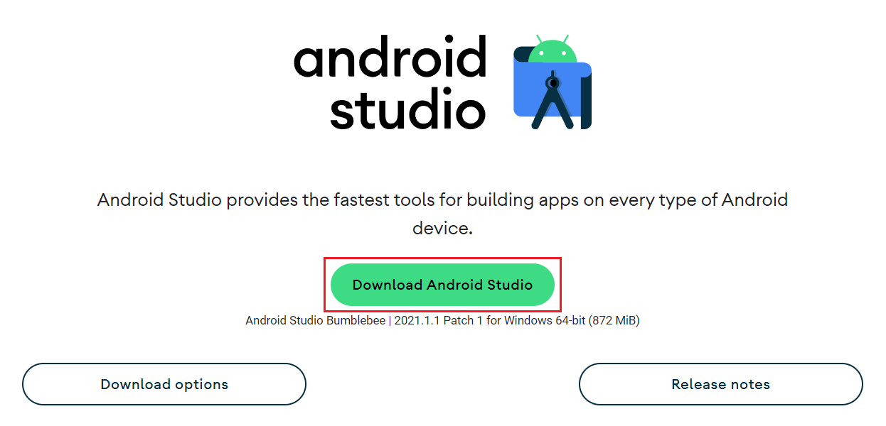
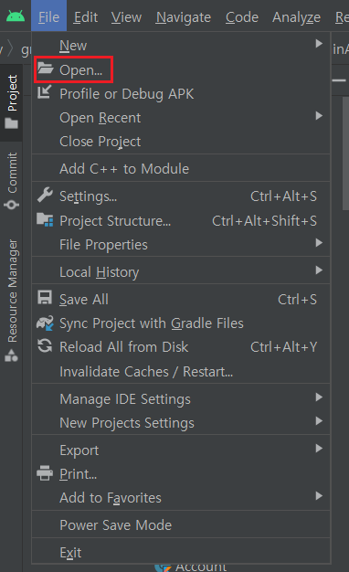
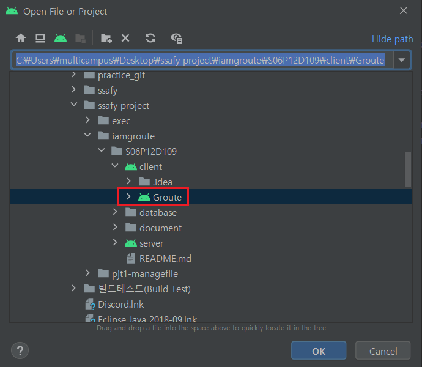
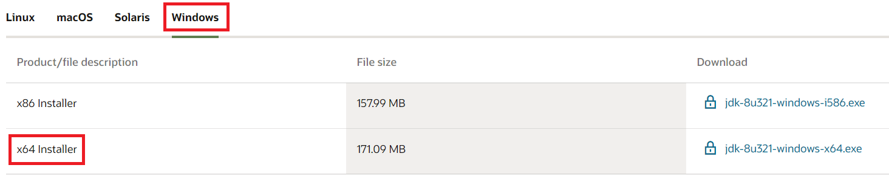
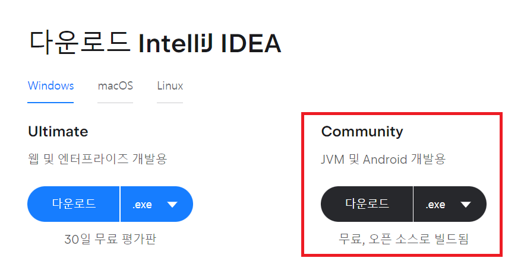
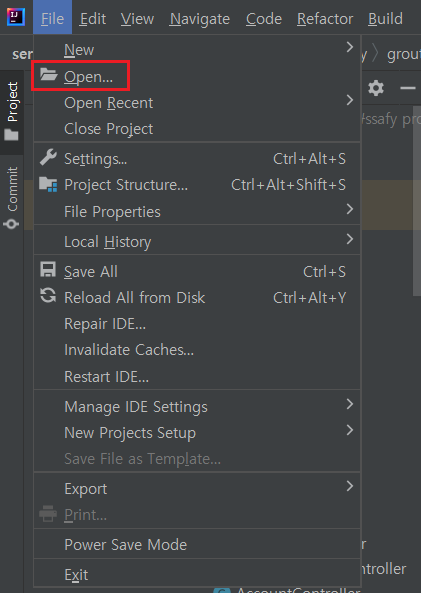
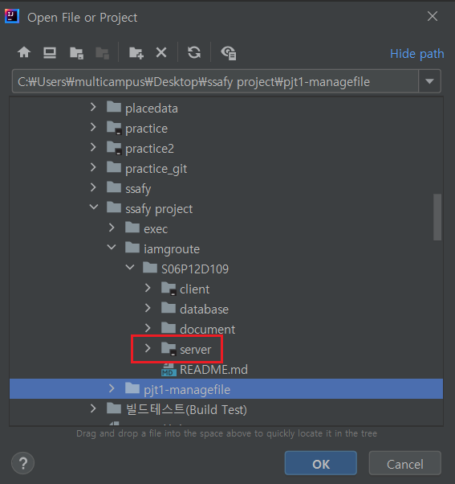
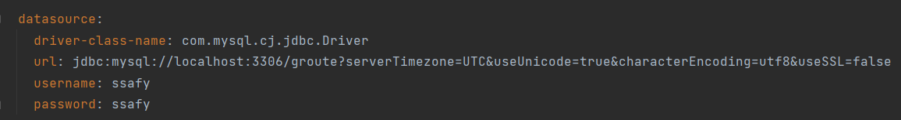

# ⭐ 실행 방법

* Frontend

  1. android studio를 설치합니다.

     https://developer.android.com/studio?gclid=Cj0KCQjw1a6EBhC0ARIsAOiTkrHs2pne0fbirqMfuaqgSYhktBtCr_y7qyEZ9YptQ6pHlX8BuYxiIAEaAmIIEALw_wcB&gclsrc=aw.ds

     혹시나 설치에 어려움이 있으신 분은 아래 설치방법을 참고하시면 됩니다.

     https://crazykim2.tistory.com/455

     

  2. android studio를 실행한 후 좌측 상단 File-open에서 아이엠그루트의 client를 받아옵니다.

     

     

  3. 아래 두가지 선택지 중 하나를 골라 android를 실행하면 됩니다.

     * 안드로이드 폰이 없는 경우 (안드로이드 스튜디오를 이용해 컴퓨터에서 에뮬레이터 실행)
       1. 안드로이드 스튜디오 우측 상단에 AVD Manager를 클릭합니다.
       2. 좌측 하단 create virtual device를 클릭합니다.
       3. phone 메뉴에서 자신이 원하는 기종을 하나 선택 후 next 합니다.
       4. 설치하고자 하는 API level을 선택 후 next 합니다.
       5. device의 이름을 설정한 후 finish하면 AVD가 생성됩니다.
     * 안드로이드 폰이 있는 경우 (개발자 도구를 이용해 폰에서 앱 실행)
       1. usb 케이블을 이용해 핸드폰과 컴퓨터와 연결
       2. 핸드폰의 설정 > 휴대전화 정보 > 소프트웨어 정보 > 빌드번호를 7번 탭
       3. 핸드폰의 설정 > 휴대전화 정보 밑에 개발자 옵션이 생김
       4. 개발자 옵션에서 USB 디버깅을 허용


* Backend

  1. Java 8를 다운로드 합니다. 

     https://www.oracle.com/java/technologies/downloads/#java8-windows

     윈도우 사용자라면 아래의 파일을 다운로드 하면 됩니다.

     

  2. intelliJ를 다운로드 합니다.

     https://www.jetbrains.com/ko-kr/idea/download/#section=windows

     

  3. intelliJ를 실행한후 File-open에서 아이엠그루트의 server를 받아옵니다.

     

     

  4. database 설정을 위해 application.yml 파일에서 database 부분을 자신의 db에 맞게 작성하시면 됩니다. (아래 사진은 mysql을 사용하는 예시입니다.)

     

     ```
       datasource:
         driver-class-name: com.mysql.cj.jdbc.Driver
         url: jdbc:mysql://localhost:3306/groute?serverTimezone=UTC&useUnicode=true&characterEncoding=utf8&useSSL=false
         username: ssafy
         password: ssafy
     ```

  5. 이 후 아래와 같은 부분을 더블클릭하면 실행됩니다.

     

     

* database
  1. mysql workbench를 실행한 후 database 설정에 맞게 유저를 생성합니다.
  2. 그 후 home에서 해당 유저로 접속 가능한 connection을 생성합니다.
  3. 동일 폴더 내 dumpdate.sql을 오픈한 후 해당 sql을 실행하면 db가 생성됩니다.